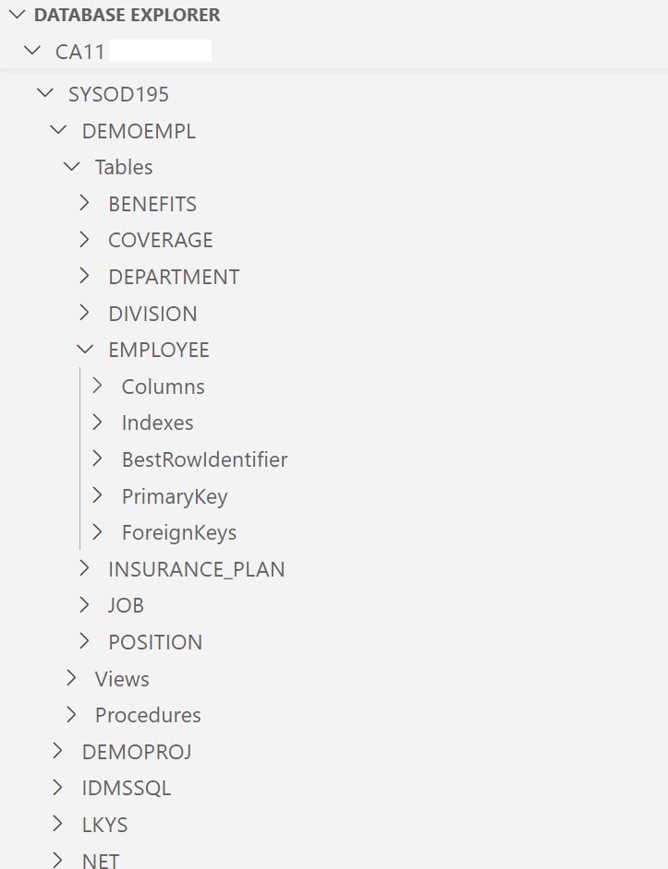
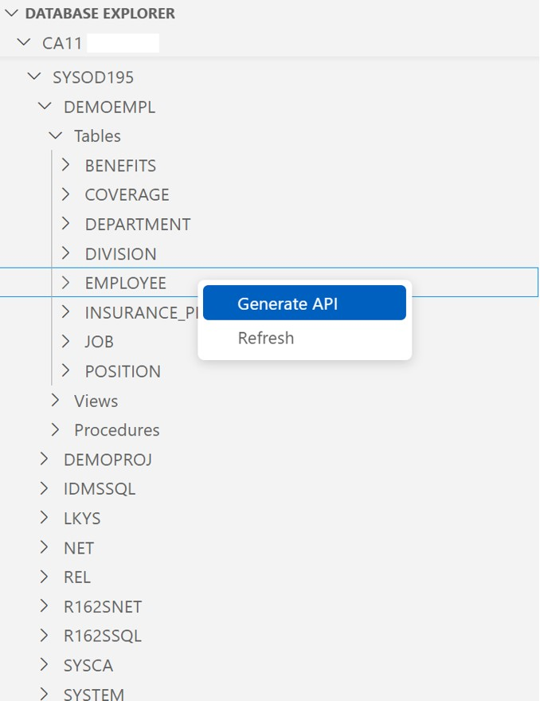

# Database API Generator

## Overview

The Database API Generator VS Code extension generates Zowe conforming REST APIs to access database resources without writing any Java code.
The extension provides a TreeView interface for you to discover the tables, views, and procedures for a JDBC enabled database,
such as Datacom or IDMS, and generates the Java model, controller, and service classes to implement the API for the selected database objects.
The Database API Generator extension uses the Database Metadata Service to discover the database objects.
The Database API Generator is used with a Spring Boot project that provides the framework for the client application.
You can create your own project or use the available Database API Sample project.

> How can we improve Database API Generator? [Let us know on our Github repository](https://github.com/BroadcomMFD/dbapi-generator/issues)

## Licenses
Before downloading this extension, review the [Broadcom License Agreement](https://techdocs.broadcom.com/us/en/ca-mainframe-software/database-management/ca-idms/19-0/release-notes/third-party-license-agreements-for-database-api-generator.html).

## Features

* `Database Explorer`: a TreeView to discover databases, tables, views, and procedures.
* `API Generator`: Generates Java model, controller, and service classes to implement the API.

## Requirements

* JDK (version 1.8)
* VS Code (version 1.19.0 or later)
* [Database Metadata Service](https://techdocs.broadcom.com/us/en/ca-mainframe-software/database-management/ca-idms/19-0/installing/install-the-database-api-generator/install-and-configure-the-database-metadata-service.html)

## Usage

The Database API Generator is designed to be used from a project that already includes the Spring Boot application framework.
Create a file named `profiles.json` in the root directory of your project.
The `profiles.json` file is part of the configuration process to use the Database API Generator.

Example `profiles.json`:
```
[
    {
        "name": "IDMS Metadata Service",
        "url": "https://localhost:8080/api/v1"
    },
    {
        "name": "Datacom Metadata Service",
        "url": "https://localhost:8081/api/v1"
    }
]
```
The dependencies to mention here would be the Database Metadata Service, which is required, and the Database API Sample project is recommended.
For complete information on using the Database API Generator [see Techdocs here](https://techdocs.broadcom.com/us/en/ca-mainframe-software/database-management/ca-idms/19-0/using/use-the-database-api-generator.html).

### Demonstration:

After defining the `profiles.json` file, open the Database Explorer panel in the Explorer sidebar, the first sidebar on the left.



This view shows a cascading tree from Metadata Service -> Data Source (IDMS CV) -> Schema -> Tables -> Employee Table.



Right click on a table to show this menu with an option to Generate API.
You can also right click on a SQL view to generate an API endpoint.
On a database that supports SQL Stored Procedures, an API endpoint can be generated for simple SQL Stored Procedures.
Alternatively, you can right click on the database schema to generate API endpoints for each table and view.

## Extension Settings

Below are the optional extension settings:

* `generate.camelCase`: Generate Java model class member names in camel case. This option allows the choice of camel case member names.

      Example: zipCode instead of ZIPCODE.

      Default: Off

* `generate.packageName`: Specifies the package name for the generated Java class files. No additional configuration required.

      Default: org.zowe.dbapi

* `generate.copyrightFileLocation`: Specifies the location of the Copyright file for the generated Java class files.

      Default: ${workspaceFolder}/src/main/resources/copyright.txt

    **Note** Broadcom does not check the validity of the content that you customize inside the copyright file. You must provide valid content inside the copyright file to ensure that the generated java class files are protected.

* `generate.schemaQualification`: Generate unique qualification of database objects using the owning schema in api components including Java tree structure, classes, endpoints, and comments. This allows for the inclusion of non-unique database objects in a single project.

      Default: On

## Release Notes

### 1.0.0

- Initial GA release.

### 1.0.1

- Fix BDSA-2023-2855 vulnerability related axios package.
- Streamline generate.packageName configuration by generating additional @Configuration classes to handle component scanning and springdoc-openapi scanning.

### 1.0.2

- Version bump to match DBAPI Common libraries.
